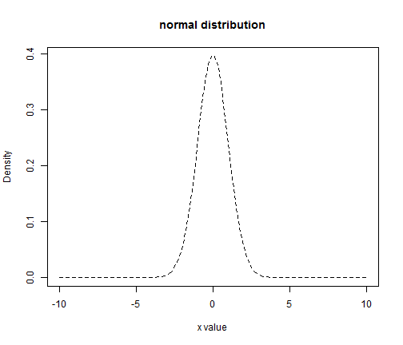

## A Simple scatter Plot ##

Let us create a simple scatterplot.


```r
require(ggplot2)
qplot(wt, mpg, data = mtcars) 
```




---


<div class="row-fluid">
  <div class="container-fluid">
    <h2 style="padding: 10px 0px;">T distribution</h2>
    <div class="row-fluid">
      <div class="span4">
        <form class="well">
          <span class="help-block">
            <h3>Plot t-distribution with specified degree of freedom, and compute p-value for the t statistics you entered</h3>
          </span>
          <div>
            <label class="control-label" for="df">Degree of freedom:</label>
            <input id="df" type="slider" name="df" value="1" class="jslider" data-from="1" data-to="100" data-step="1" data-skin="plastic" data-round="FALSE" data-locale="us" data-format="#,##0.#####" data-smooth="FALSE"/>
          </div>
          <label for="tstatistics">Enter t statistics (-10 to 10) :</label>
          <input id="tstatistics" type="number" value="0" min="-10" max="10" step="1e-04"/>
          <label class="checkbox" for="checkbox1">
            <input id="checkbox1" type="checkbox" checked="checked"/>
            <span>show normal p value</span>
          </label>
          <div>
            <button type="submit" class="btn btn-primary">Submit</button>
          </div>
        </form>
      </div>
      <div class="span8">
        <div id="text1" class="shiny-text-output"></div>
        <div id="text2" class="shiny-text-output"></div>
        <div id="text3" class="shiny-text-output"></div>
        <div id="text4" class="shiny-text-output"></div>
        <br/>
        <div id="plot1" class="shiny-plot-output" style="width: 100% ; height: 400px"></div>
      </div>
    </div>
  </div>
</div>

--- &radio

## Quiz

Which one of these slifify slides do you like the most?

1. I don't like any of these slides 
2. A simple plot
3. T distribution
4. _I can not tell. All is interesting._

*** .hint
This is a hint

*** .explanation
This is an explanation


